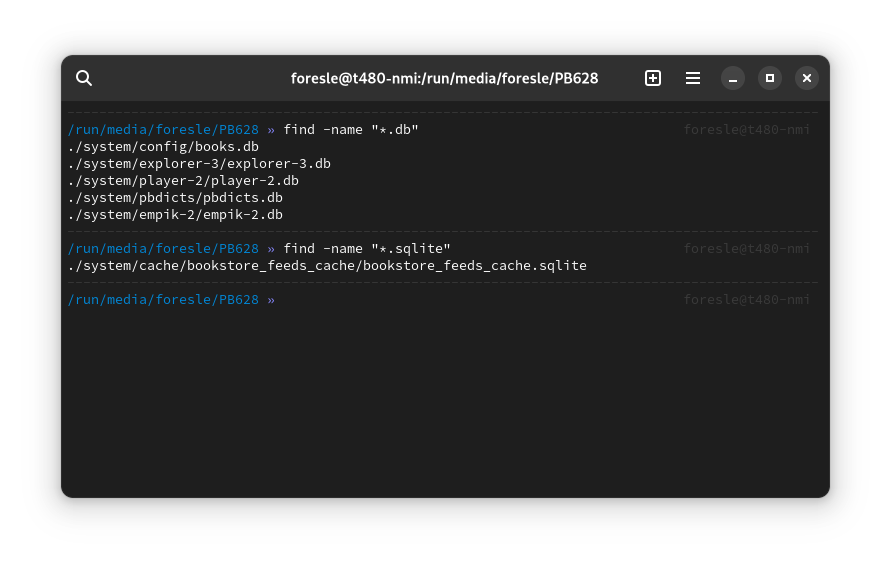
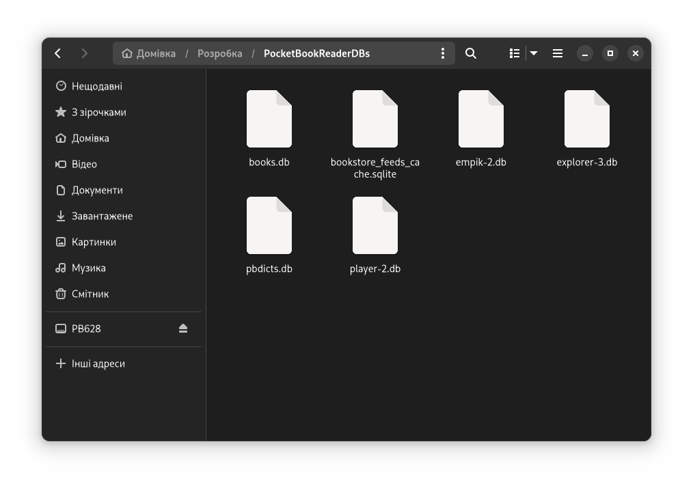

# Pocket Book Reader

Коли я купив той рідер то завантажив до сто бісів книжок, але більшість не читав далі анотації і просто видалив. Рідер не розуміє моєї потреби в чистоті тому тепер в БД лежать зайві записи про книги яких не існує, мене це не аби як бісить, а нормальної або хоча б якоїсь програми для контролювання цього процесу не існує, тому треба якось викручуватися.

Просто видалити та створити нову обліковку Pocket Book Cloud не вийде, адже доведеться видалити також обліковку крамнички разом з купленими раніше книжками, а ще втрачу нотатки.

Єдиний варіант який я бачу це влізти в БД напряму (там sqlite), відредагувати все і потім синхронізувати.

## До справи

Спочатку треба знайти абсолютно всі БД на рідері перед цим синхронізувавши його з хмарою.

```shell
find -name "*.db"
find -name "*.sqlite"
```



Для зручності скопіюю всі файли в одну теку та розберуся що знаходиться в кожній БД.

```shell
mkdir ~/Розробка/PocketBookReaderDBs
find -name "*.db" | xargs cp -t ~/Розробка/PocketBookReaderDBs
find -name "*.sqlite" | xargs cp -t ~/Розробка/PocketBookReaderDBs
```



Переглядатиму в `sqlitebrowser`.

- `bookstore_feeds_cache.sqlite` - пуста.
- `player-2.db` - пуста.
- `empik-2.db` - пуста.
- `pbdicts.db` - словники.
- `explorer-3.db` - шляхи до файлів книжок.
- `books.db` - вся інформація щодо книжки, разом з нотатками.

Власне мене цікавить лише дві останні БД, саме в них лежать зайві записи.

Виписав `id` кожної книги яку я видалив і не читав (з БД `explorer-3.db`), після цього видаляю записи спочатку в таблиці `books_settings`, а потім `books_impl`.

Список `id`-шок: `1, 2, 3, 4, 5, 6, 8, 9, 10, 11, 12, 13, 14, 15, 16, 18, 19, 20, 21, 26, 33, 34, 35, 40, 41`

```sql
DELETE FROM books_settings WHERE bookid IN (1, 2, 3, 4, 5, 6, 8, 9, 10, 11, 12, 13, 14, 15, 16, 18, 19, 20, 21, 26, 33, 34, 35, 40, 41);
```

```sql
DELETE FROM books_impl WHERE id IN (1, 2, 3, 4, 5, 6, 8, 9, 10, 11, 12, 13, 14, 15, 16, 18, 19, 20, 21, 26, 33, 34, 35, 40, 41);
```

Тепер наступна БД `books.db`.

Знову `id`-шки: `2, 3, 4, 5, 6, 7, 9, 10, 11, 12, 13, 14, 15, 16, 17, 18, 19, 20, 21, 26, 33, 34, 35, 40, 41`

```sql
DELETE FROM Books WHERE OID IN (2, 3, 4, 5, 6, 7, 9, 10, 11, 12, 13, 14, 15, 16, 17, 18, 19, 20, 21, 26, 33, 34, 35, 40, 41);
```

Лишається таблиця `Items` з купою записів, спочатку видаляємо залежні `ParentID`, а потім `OID`.

```sql
DELETE FROM Items WHERE ParentID IN (2, 3, 4, 5, 6, 7, 9, 10, 11, 12, 13, 14, 15, 16, 17, 18, 19, 20, 21, 26, 33, 34, 35, 40, 41);
DELETE FROM Items WHERE OID IN (2, 3, 4, 5, 6, 7, 9, 10, 11, 12, 13, 14, 15, 16, 17, 18, 19, 20, 21, 26, 33, 34, 35, 40, 41);
```

З таблиці `Tags` записи видаляться автоматично разом з `Items`.

Що ж, тепер можна зробити бекап таблиць та відредагувати оригінали, після синхронізувати рідер з хмарою і подивитися, що з цього вийшло.

#### Все вийшло 🫠️.
