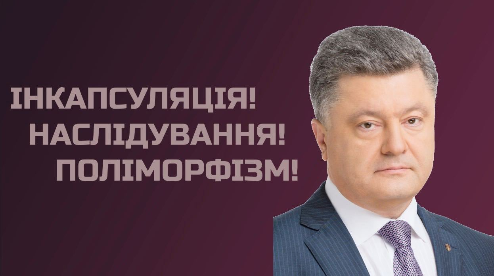

Перший досвід в програмуванні на мові Delfi/Pascal я отримав у школі, хоча це виглядало доволі тупо. Нам не розказували за одинички чи нулики, не пояснювали, що таке змінні, все що вимагали на тих кількох уроках це переписати шматки коду з підручника. Це було настільки погано, що я не одразу зрозумів, що відбувається.

А знати, що відбувається мені потрібно завжди, адже це база. Якщо не знати як щось влаштовано, то можна повірити та в магію, або навіть бога... 🤯️

Відчуття незнайомості з причиною роботи явища, пристрою, крім цікавості викликає тривожність, відчуття небезпеки. Мені важливо знати з чим я працюю.

А коли знаєш як щось працює то з певними зусиллями зможеш повторити, класно ж побути "творцем" не віруючи в нього 😉️

Так от якось я гуглив як створювати програми та з жахом зрозумів, що тоді не просто переписував код, - я творив.

Розуміння того яким чином працює комп'ютер та програми накладає фільтр на подальше життя, мислення стає логічнішим, а принципи константами.

За часи школи я ще встиг спробувати C++, Java ти HTML/CSS. Як же було класно правити сайти прямо в браузері, щоб здивувати тодішніх друзів.

Цікавився я також різновидом операційних систем, першим Linux-ом став Mint, далі Kali. Взагалі Kali не так просто в мене стояв у віртуальній машині, я марив написанням вірусів та зламом wifi мереж.

Деякий час мого життя я не пам'ятаю на жаль чи на щастя, мабуть все-таки друге. Це період стагнації з php та JS разом з вже згаданим HTML/CSS.

Проте все змінилося з початком пандемії, вже мав початкові знання з Python, а також сповідувати принципи ООП, які також доволі сильно доповнити мій світогляд та перетворити атеїзм у константу.

Тоді я познайомився з Open-Source чим заново відкрив для себе Linux, та пробудив те відчуття небезпеки до невідомого. Весь закритий код став для мене  небезпекою, я замінив програми одну за одною, прошивав смартфон та видалявся з централізованих мереж. Надалі я не нив із за поганого функціоналу програм, адже я творець, я можу створити бажаний функціонал, або модифікувати програму, відкриту, безплатну, без реклами та стеження.

Попри все це тоді я не визначився зі своєю основною мовою, пишучи на кількох, це треба було виправляти і я обрав Python.

Наразі моє життя тісно пов'язане з програмуванням, моє мислення працює по строгим правилам, а вчення чомусь гуманітарному стає нестерпно складним, такі от недоліки.

Одже чому я програмую? Це приносить задоволення, кожен раз коли виконую чергову таску не наче виконую квест, а моя винагорода це кайф від результату. Програмування я вже не зможу покинути, воно є ґрунтом мого світогляду і я не проти.
