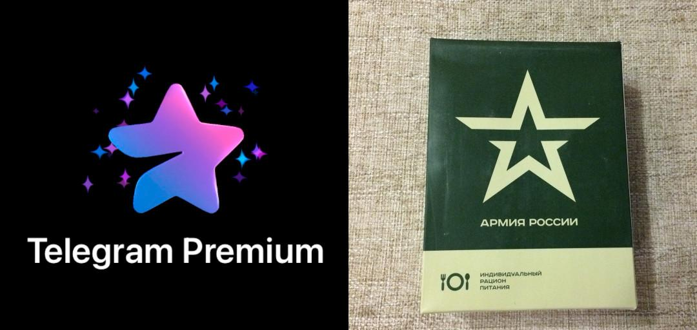

## Чому Telegram не такий як ви про нього думаєте?

Я не раджу його використовувати нікому, взагалі, а тим більше купувати преміум підписку.

### Розробники

Перше, що хочу підмітити, - Telegram розробка московитів, всі ваші дані в їх руках, це як мінімум насторожує.

### Анонімність

Telegram немає нічого спільного з анонімністю, оскільки прив'язаний до номера телефону. Він просить дозвіл також до GPS, та списку контактів, пасивно відправляє ці дані на свої сервери, тим самим де анонімізує вас. Навіть якщо ви не використовуєте Tg, про вас є інформація в їх БД, оскільки ваш номер може бути записаний в контактах ваших друзів, родичів, т.п.

Якщо Tg захочуть продати, то продадуть разом з БД, тобто всією накопиченою інформацією про вас.

### Російська влада

Telegram співпрацює з російською владою, ФСБ. Він заборонений для використання в ЗСУ.

### Шифрування, (конфіденційність листування)

Telegram не шифрує ваші повідомлення, навіть в так званих "секретних чатах", ніхто не проводив незалежний аудит, щоб підтвердити це, і не зможе, тому що код серверної частини закритий.

### Надійність

Telegram централізований, і може перестати працювати в один момент, цілком і повністю, як це вже було.

## Якщо не Telegram, то що?

Не варто йти з Telegram і інші централізовані месенджери по типу: **Viber**, **Whatsapp**, etc. Це вибір між меншим і більшим злом, майже всі наведені тези можна приписати до наведених зверху альтернатив.

В них всіх є одна незмінна проблема, - централізованість...

## Matrix

Matrix, - поки найліпше розв'язання проблеми, але воно не розповсюджене в Україні, на жаль.

Незалежний, відкритий месенджер, він позбавлений вище озвучених вад.

Проте почекайте, не варто зараз гуглити "Matrix", бо так ви нічого корисного не знайдете (якщо ви не розробник).

Погляньте на наступну схему:

### Пояснення схеми

Я впевнений, що у вашому уявлені заклалася така картина, що месенджер можна завантажити і відкрити на своєму девайсі, проте він лише цим не обмежуються, структура складніша. Те що ви завантажили називається клієнтом, часто назва однойменна з команією-розробником. Цей клієнт безкорисний без сервера, саме там зберігаються, та пересилаються ваші повідомлення та інші дані. Telegram і йому подібні мають купу серверів, та вони всі підпорядковуються одним правилам, та одному власнику. Власне це і називається **централізацією**.

В Matrix схема інакша, клієнтів є декілька (**ShildiChat**, **Cinny**, **Element**, etc), всі вони відрізняються дизайном та дрібним функціоналом, варто спробувати різні і вибрати той що найбільше сподобався. Саме тому вживання "Matrix/Element", "Element" в контексті месенджера є хибним, Matrix!=Element.

Сервери не підконтрольні будь-якій компанії, на додаток ви можете створити свій сервер, зі своїми правилами, якщо схочете.

В кожному сервері є свої правила, вам залишається лише вибрати той що підходить вам, наприклад мій :)

Одже підсумуємо, Matrix - це загальна назва цього месенджеру, тому не варто шукати "Matrix" в Google Play чи інших маркетах.

### Як цим користуватися?

Розгляньмо приклади використання **Matrix** в клієнті **ShildiChat** (Завантажте клієнт з Play Market, або F-Droid).

Реєструватимуся на моєму сервері: `matrix.opulus.space`

#### Створення облікового запису

Придумайте нік та пароль.

Оскільки сервери різняться, ваш нік доповнюється адресою сервера: *@nickname:matrix.opulus.space*, де *nickname* це ваш нік, *matrix.opulus.space* адреса сервера.

#### Шукаємо ваших знайомих (особисті чати)

Ви можете листуватися також з людьми з інших серверів.

#### Публічні кімнати (групи)

#### Зміна аватару та імені

### Підтримка

Це все діло потребує підтримки, оскільки не має постійного фінансування і живе коштом ентузіастів. В першу чергу розповсюджуйте інформацію про Matrix, ділиться цією статтею... Також підтримуйте обраний сервер донатом якщо можете, пам'ятайте кожна гривня полегшує життя адміністраторам сервера, які оплачують сервер зі свого гаманця, а ще підтримують його постійну роботу, витрачаючи свій час.
