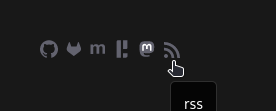
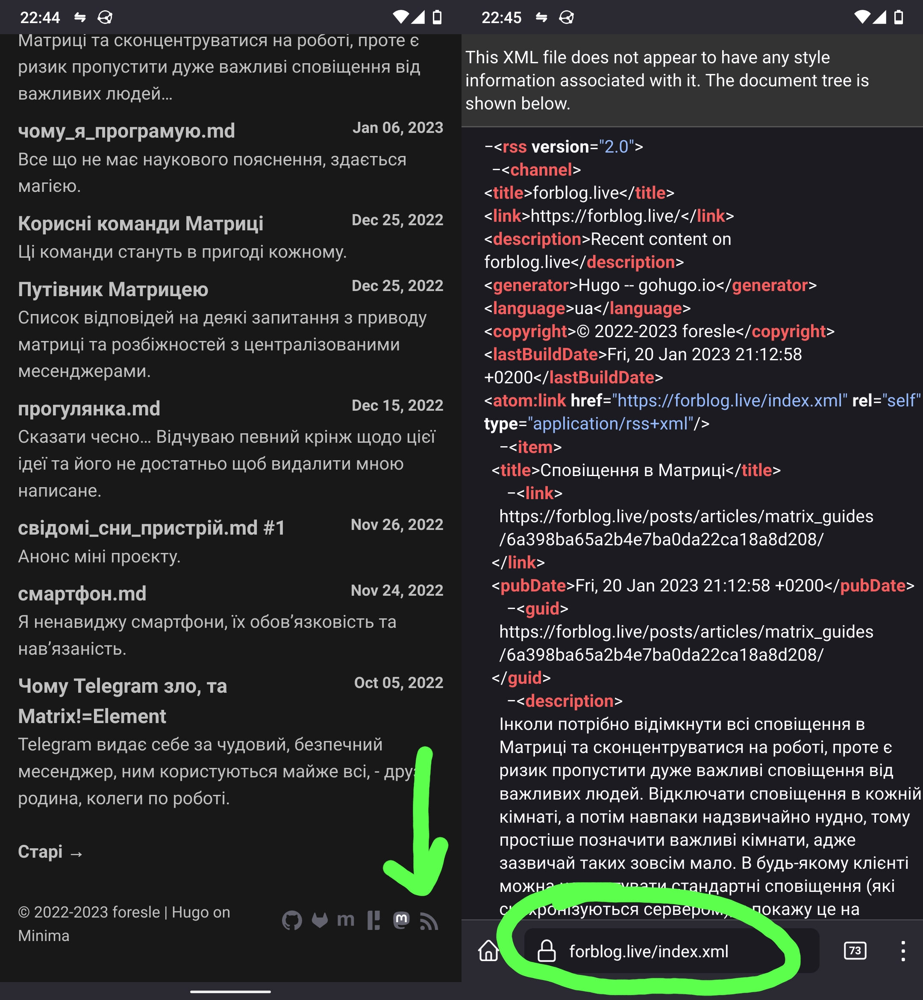
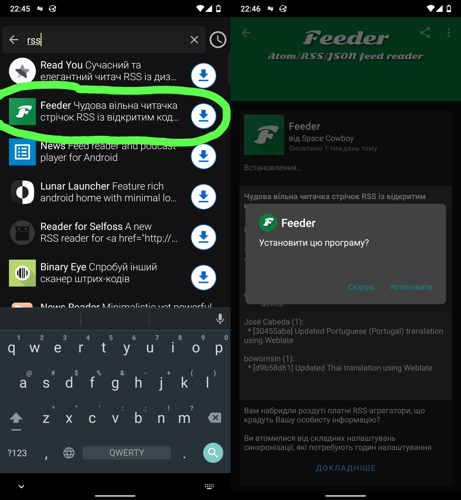
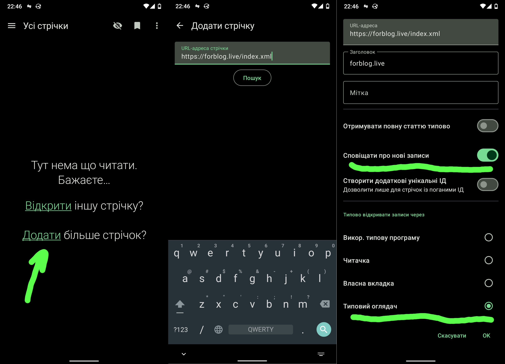
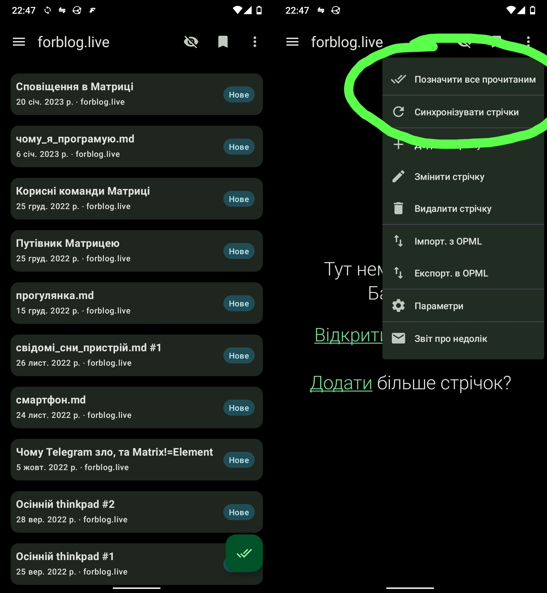
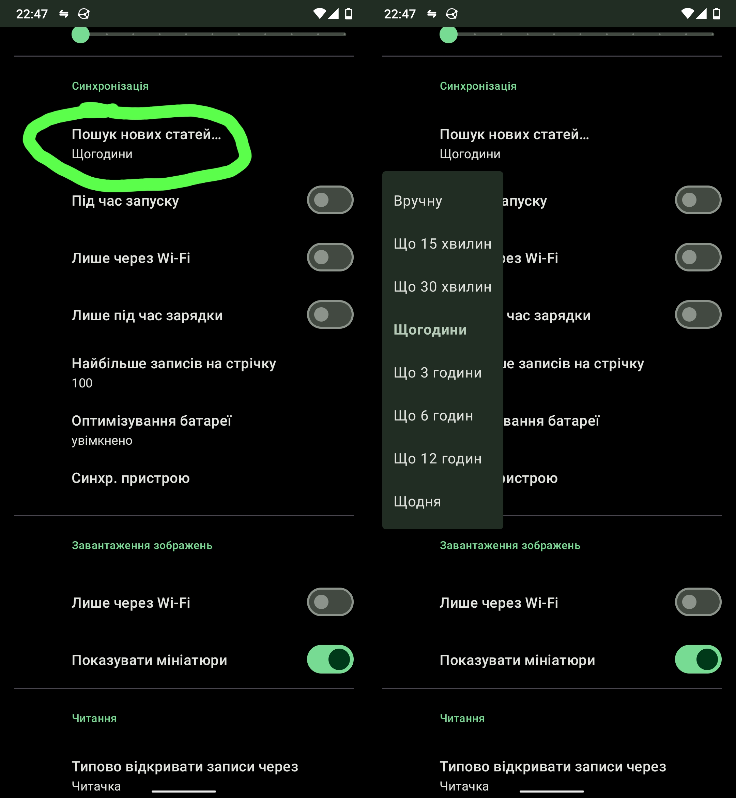

`RSS` придуманий для того, щоб було зручно отримувати новини з ваших улюблених сайтів в одному місці. Більшість сучасного вебу вміє у `RSS`,  проте про нього мало хто чув, або користується (навіть я тим не користуюся).

Все ж ви можете спробувати, підібрати цікаві для вас сайти, або навіть отримувати сповіщення з YouTube про нові відео на каналі. Для цього на сайті потрібно знайти іконку подібну до тої що на знімку екрана знизу.

Розглянемо приклад на моєму блозі та налаштуємо `RSS` на смартфоні.

Знайдіть іконку `RSS` на сайті, та натисніть на неї, ви побачите купу незрозумілого тексту, все гаразд, цей текст зрозумілий для читалки `RSS`. Просто скопіюйте посилання, завдяки йому читалка зможе слідкувати за оновленнями на сайті.

Перейдемо до самої читалки, я буду використовувати [Feeder](https://f-droid.org/en/packages/com.nononsenseapps.feeder/) з `F-Droid` (в `Play Market` теж має бути купа такого), ви можете взяти таку ж, або іншу яка сподобається, дії будуть схожими всюди.

Тепер залишилося лише додати `RSS` стрічку блогу (це те посилання яке треба було скопіювати). Все доволі просто, додаткові параметри виставляйте на власний розсуд.

Після цього читалка автоматично підвантажить всі останні статті, все нормально, адже це перша синхронізація, якщо ці статті прочитані вами раніше (що цілком ймовірно), то можна просто позначити одразу всі як прочитанні.

Чудово! Також важливим буде налаштувати читалку під себе в загальних налаштуваннях, як от тайм-аут між синхронізацією.

