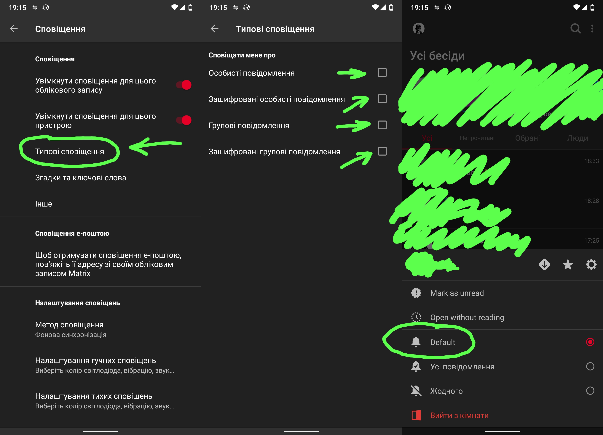

Інколи потрібно відімкнути всі сповіщення в Матриці та сконцентруватися на роботі, проте є ризик пропустити дуже важливі сповіщення від важливих людей.

Відключати сповіщення в кожній кімнаті, а потім навпаки надзвичайно нудно, тому простіше позначити важливі кімнати, адже зазвичай таких зовсім мало.

В будь-якому клієнті можна налаштувати стандартні сповіщення (які синхронізуються  сервером), я покажу це на прикладу `ShildiChat`.

Так от розділімо чати на три категорії:

- Важливі
- Помірно важливі
- Неважливі

З важливими та неважливими кімнатами все просто, просто виберіть в меню відображати **усі повідомлення** або **жодного**.

У всіх кімнатах по замовчуванню стоять глобальні налаштування сповіщень, тому, всі сповіщення помірних кімнат ви можете відключити й навпаки разом, в налаштуваннях. 

Знайдіть параметр "Типові сповіщення" або подібний йому у своєму клієнті, та налаштуйте як вам зручно всього чотирма чек боксами.

