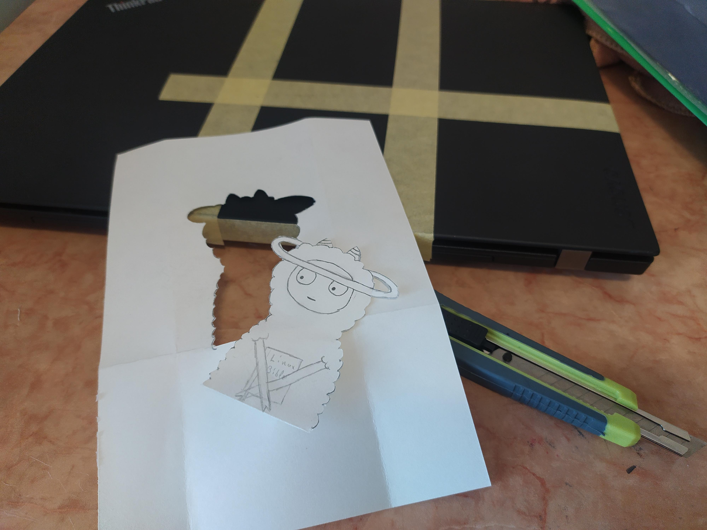
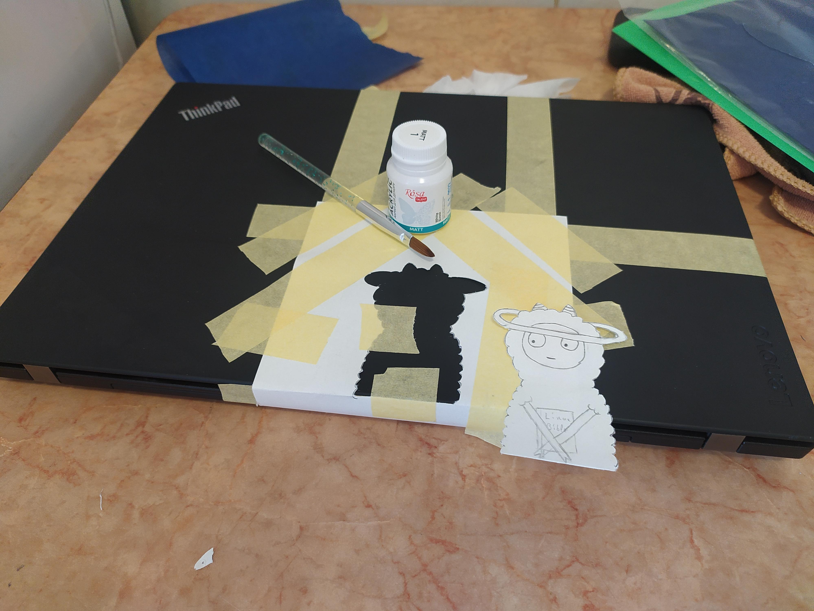
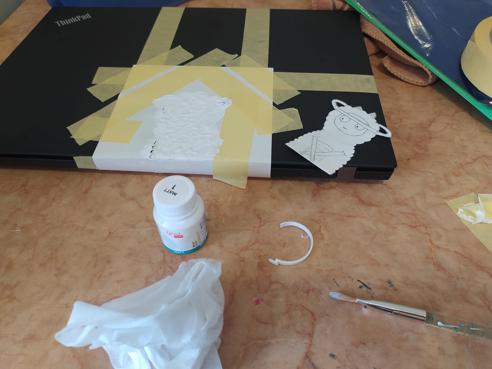
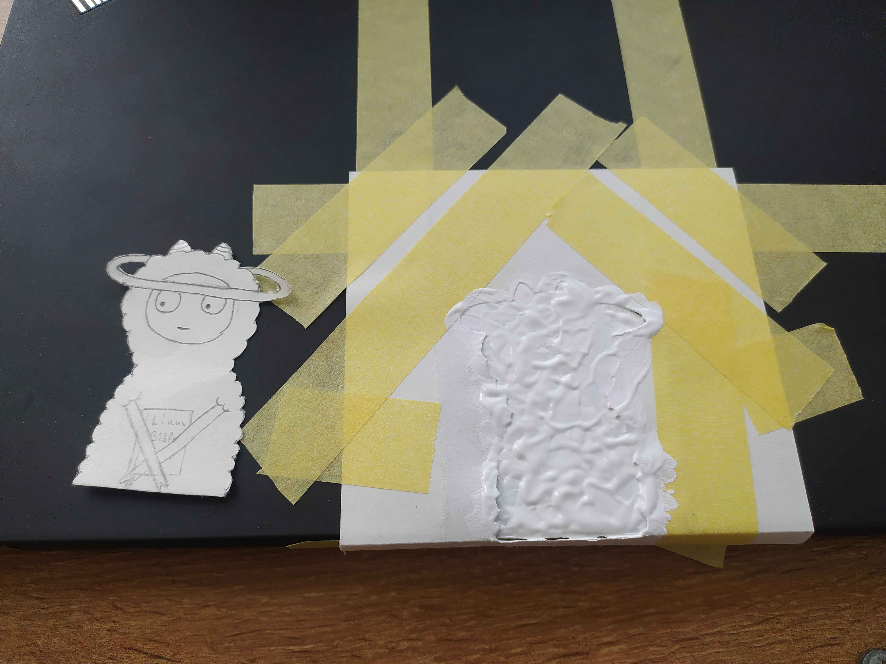
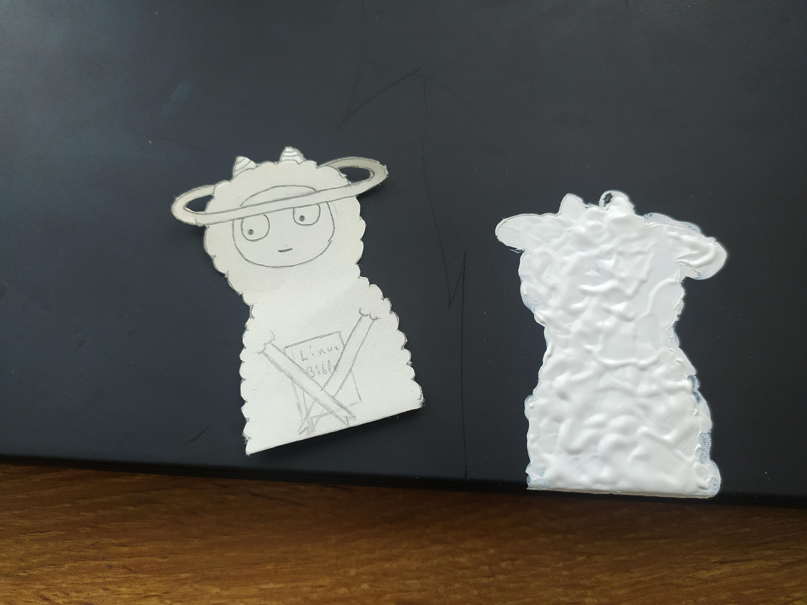
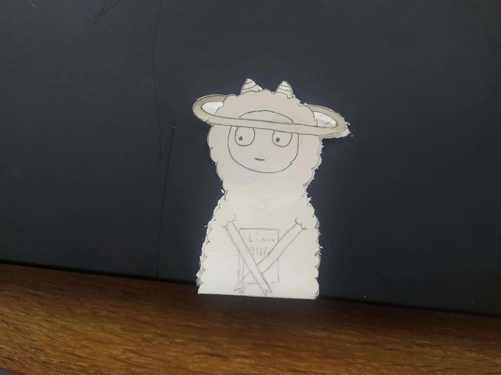

Давно я не перевстановлював систему, так нудно працювати, коли немає нічого нового...

Перевстановив, з основних змін:

- Ядро zen
- Файлова система btrfs

Не знаю чи має сенс прикріпляти конфіг... Це все ще чергова збірка на Gnome, ну а як без нього)

Ось що вийшло:

Та це не все, я завжди хотів зробити свій ПК візуально іншим, хоч частина корпусу підклеєна скотчем, а на кришці подряпина на весь ріст :) цього мені мало... Ідея банально заклеїти наліпками мені не сподобалася... Замість цього я подумав намалювати невеличкий арт і якщо вийде, то міняти його раз у два місяці чи типу того, цікава буде галерея)

Отож, я взявся робити то, персонаж уже відомий по моїм малюнкам)

Одразу перейду до першої реалізації, я швиденько накинув скетч, та вирізав типу трафарет, ідея в тому щоб зафарбувати силует білою, матовою, акриловою фарбою, і коли вона підсохне то стане чудовою та витривалою основою для подальшого фарбування, маркерами або навіть олівцями...

Ось декілька знімків:

Очікувано проблемою стало, те що папір не щільно прилягав до корпусу із-за цього я отримав не рівні контури(

Я пошукав серед канц товарів те що може мені допомогти, взяв кольоровий, клейкий папір, цікаво чи є такий папір спеціально для таких цілей, просто білий клейкий папір 🤔

Щоб не забити на цей проєкт, я виклав зараз першу частину, очікуйте наступної 🤗
