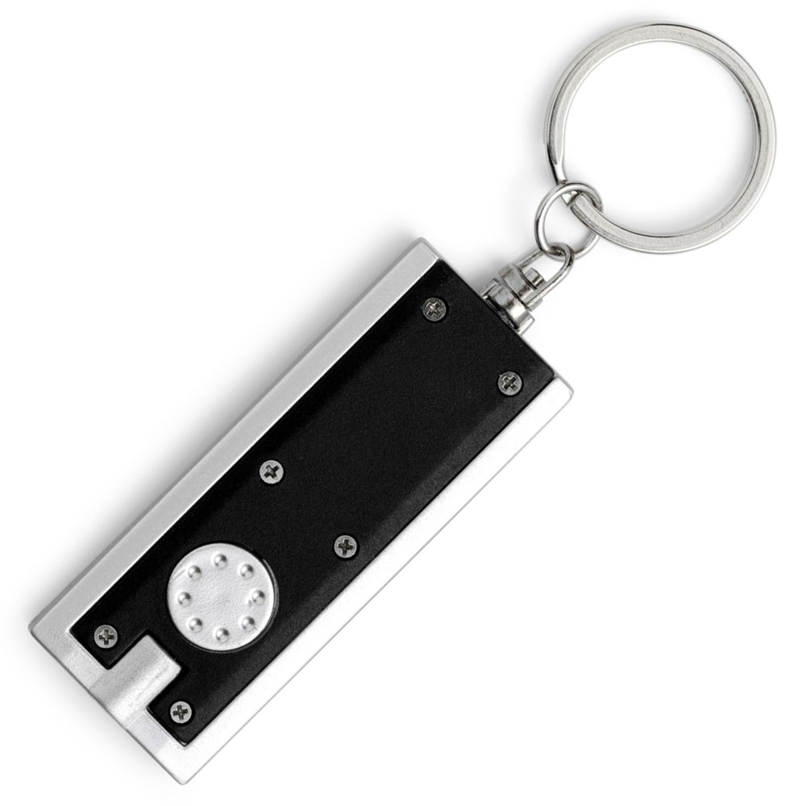
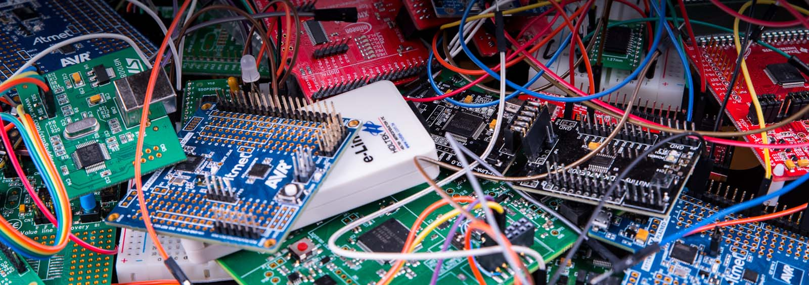
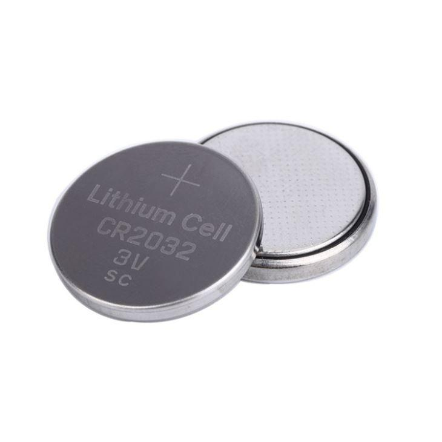
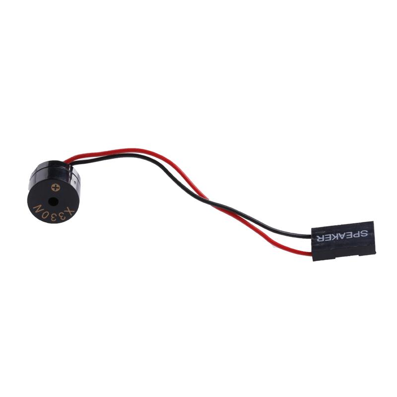
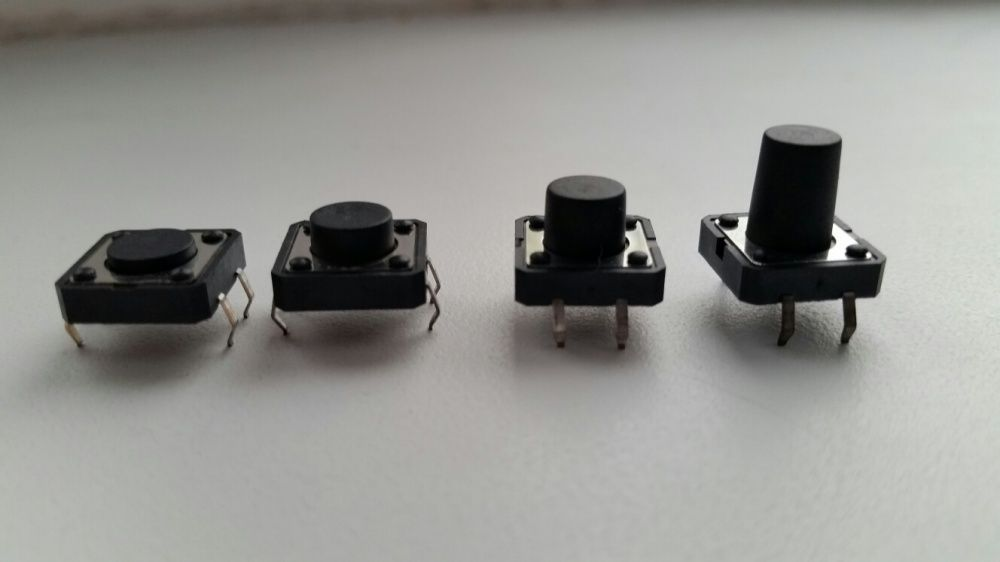

Мабуть, треба потім придумати нормальну назву, з якимсь цікавим сенсом, можливо жартом. Обов'язково займуся цим коли матиму нормальний запас ресурсів.

Це той проєкт, який постійно згадується в голові та відкладається "на потім", в наслідок чого отримуєш кашу з думок в голові.

Це перший текстовий файл, анонс в моєму блозі, спробую так очищати мозок інколи.

## До діла

Гаразд, перейдемо до пристрою, що він з себе уявляє? Це нагадувальник, який кожної години буде видавати сигнал, нагадуючи про себе.

Згадав про те як в серіалі "Mr.Robot" персонаж "Біла Роза" ставив таймер кожного разу як з'являвся у кадрі. На цьому був зроблений акцент, персонаж постійно слідкував за часом відведеним на певну подію.

## Нагадування

Про сни я планую написати окремий текстовий файл, тому коротко, - одна з методик потрапити у свідомий сон, це постійно запитувати себе "Де я був 5-хв назад?", та "Як я сюди потрапив?". Таким чином це утворить рефлекс, та одного разу під час сну ми запитаємо в себе це питання і зрозуміємо що ми уві сні. Пригадайте самі, кожного разу сон починається з будь-якого місця без бекграунду, то як ви там опинилися?).

## Просте рішення

Покласти це завдання на смартфон, мабуть, дійсно б мало сенс, та читайте -> [смартфон.md](), а ще його потрібно часто заряджати.

Крім цього, я сюди погратися з мікроконтролерами прийшов, а не шукати просте рішення :).

## Вигляд

Спочатку я думав про те, щоб зробити корпус у вигляді годинника, та це складана задача, (в DIY проєктах завжди проблеми з корпусами), та й вийде щось громіздке.

Інша ідея зробити маленьку прямокутну коробочку, розміром з "брелок-ліхтарик", або коробку з під сірників.

Закинув в кишеню і пішов по справам.

На самому корпусі не буде технологічних дірок, окрім однієї, - для кнопки.

## Начинка

Я працював лише з `Arduino Leonardo` та `ESP8266` від `NodeMCU`, тому не дуже знаюся на ринку мікроконтролерів. Треба підібрати щось не таке круте як `ESP8266` і енергоефективне з живленням 3v.

Хоча за живлення треба подумати краще. Не хочу тягнути акумулятори та DC->DC перетворювачі в цей проєкт, а обійтися батарейкою яку використовують в годинниках та материнських платах.

Для сигналу можна використати вібромоторчик, та я  все ж хочу, або маленький п'єзо динамік, або "спікер" як в материнській платі. Цікаво до речі, що споживатиме більше енергії.

Керування як було згадано вище виконуватиме лише одна кнопка, звичайний "мікрік" підійде.

Спочатку думав, що потрібно використати платку `RTC`, та це зайве місце в корпусі і додаткова батарейка, алгоритм теж не ефективний буде.

Є інша ідея, про яку стане зрозуміло з опису інтерфейсу.

## Інтерфейс

В "мікріка" буде декілька дій:

 - Якщо зажати кнопку на 3-сек., то час скинеться і почнеться відлік на 60-хв. Тобто, щоб налаштувати пристрій треба в будь-яку "рівну" годину зажати цю кнопку.
 - Коли пролунає сигнал, а він буде тривати ~5-сек., можна його пропустити, однократним натиском.
 
Щоб вимкнути пристрій потрібно витягти батарейку, але знадобиться повторне налаштовування.
 
## Коли?, Побачим, коли)

Цей анонс зроблений швидше для того, щоб прибрати нав'язливу думку з голови, проте проєкт я розробляти буду, просто не ставитиму ніяких дедлайнів.
