## Ого, це хтось читає 👀

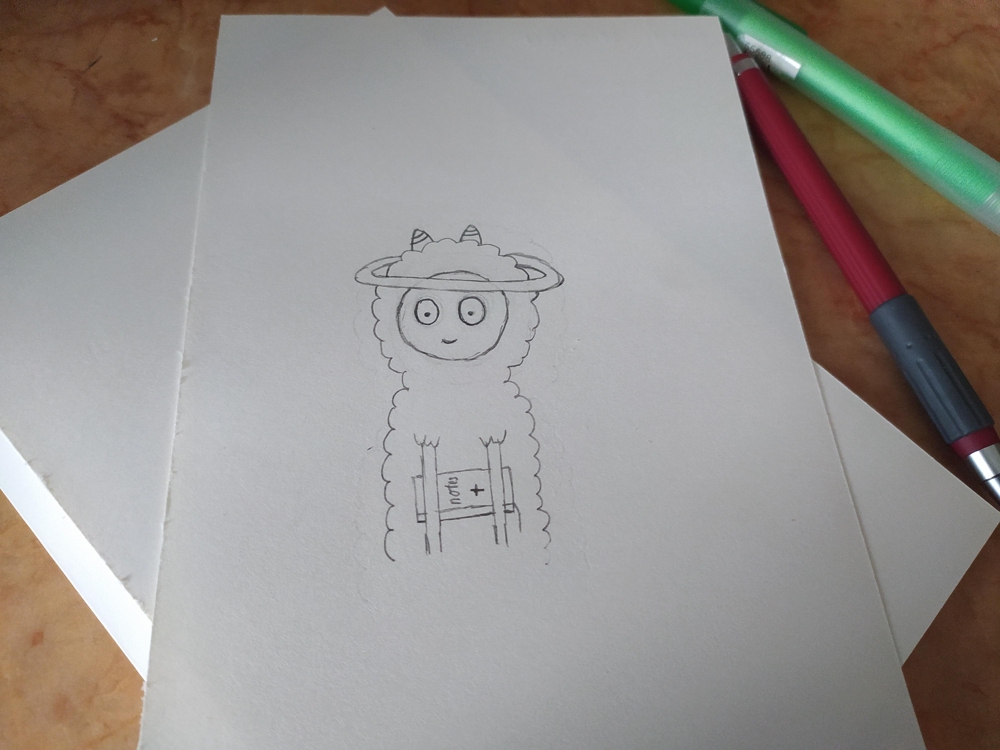

Ну от, маємо скетч, беремо копірку і перекидаємо на клейкий папір.

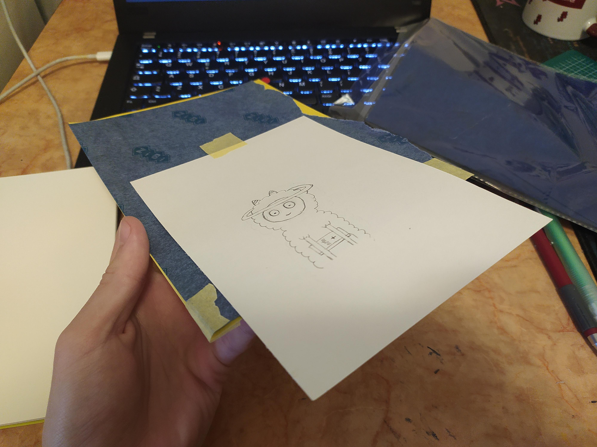
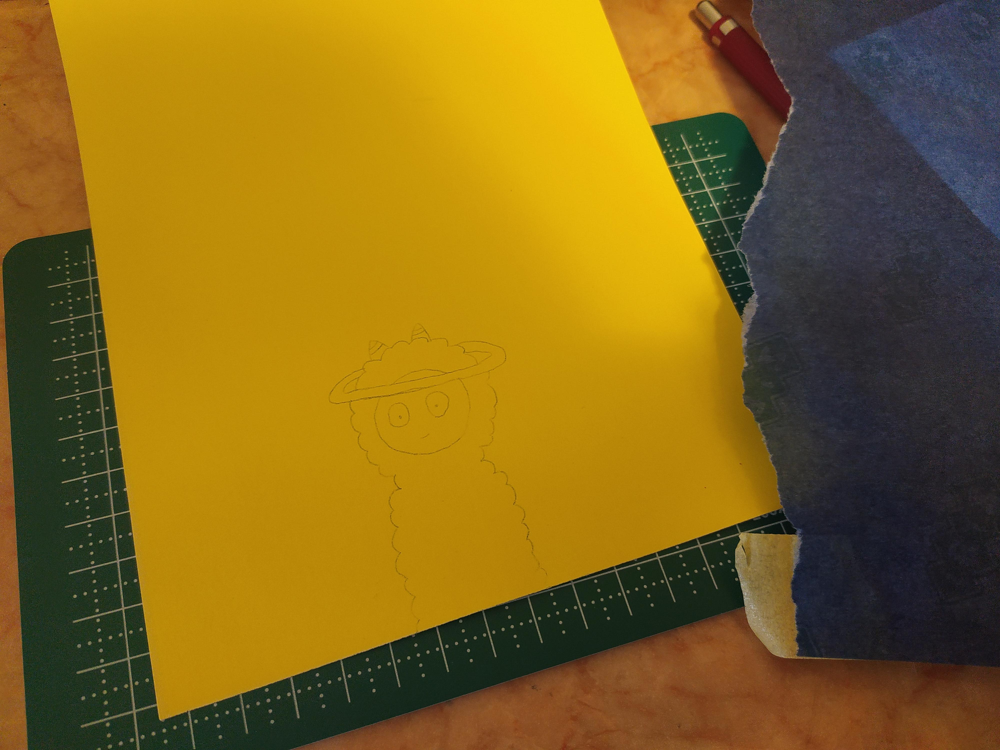

Скальпелем, навіть таким поганим, набагато легше то вирізати.

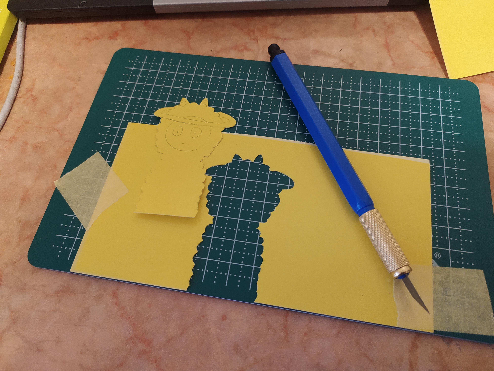
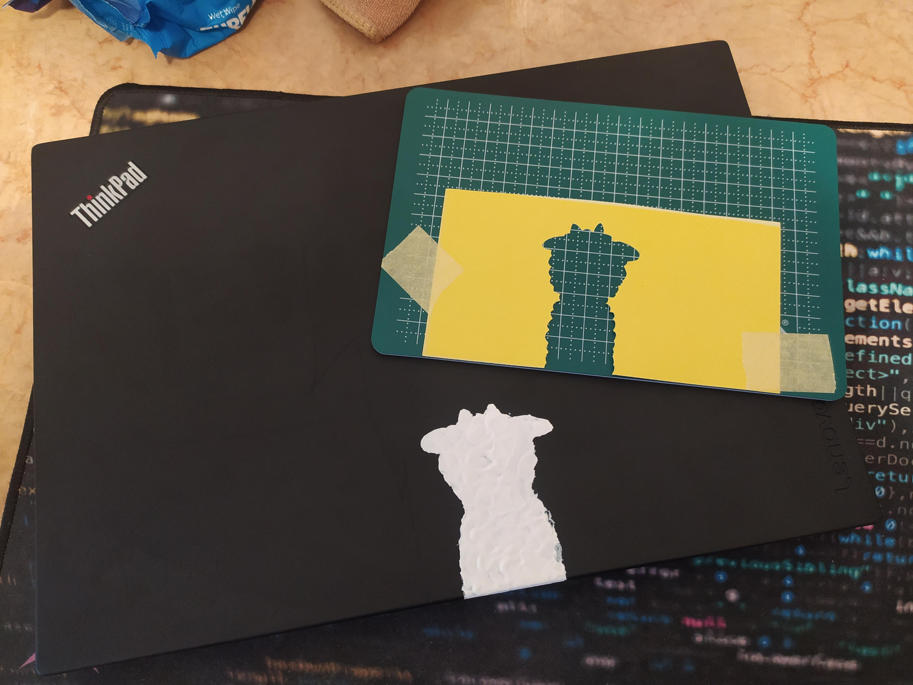

Цей килимок, спеціально для таких завдань, щоб не страждав стіл від порізів :)

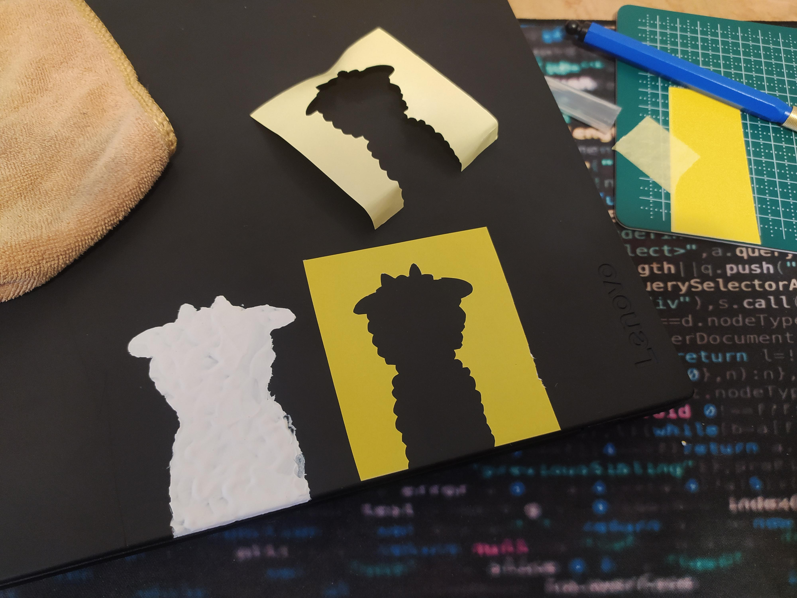
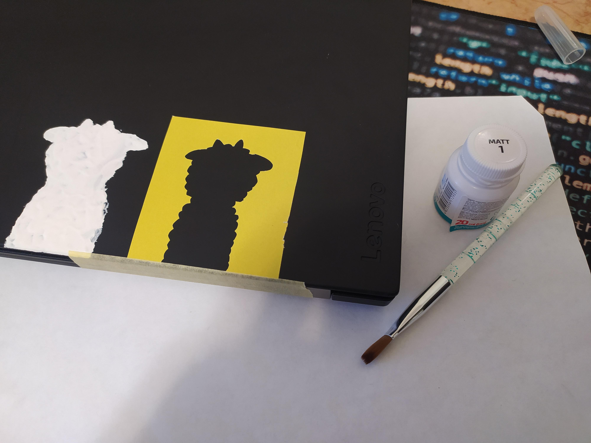
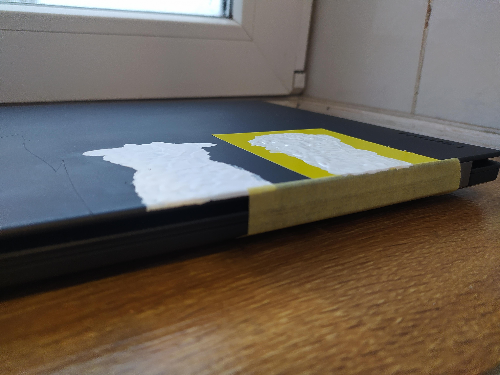

Фарбую так само, і зоставляю сохнути на ніч.

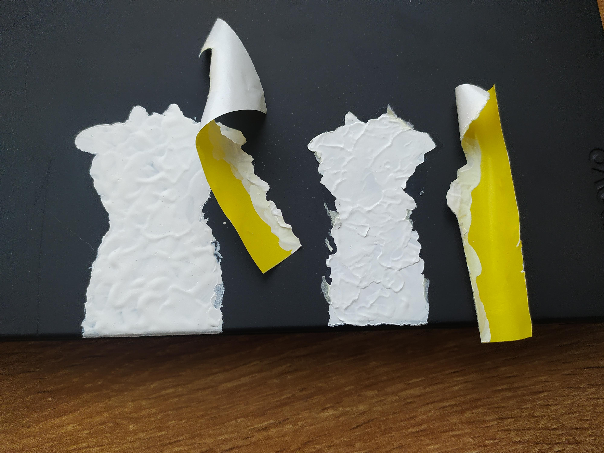

Власне, я думав що краще зняти трафарет вже коли фарба підсохне, прикро, але час підібраний не правильно, треба було знімати або через годину або через декілька днів, коли фарба закам'яніє...

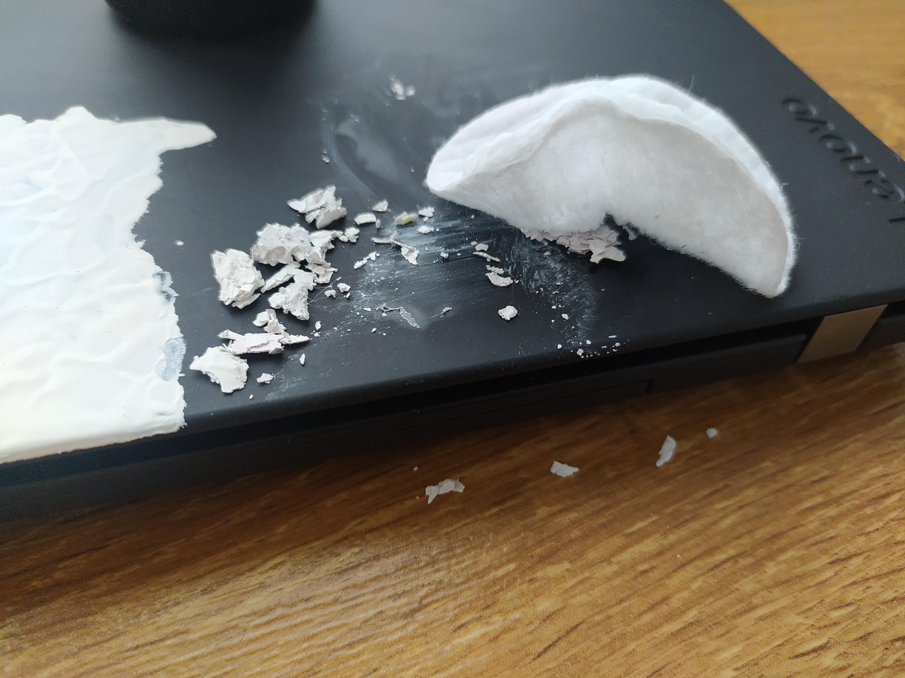

Спиртом можна легко стерте ще не зовсім висохлу фарбу.

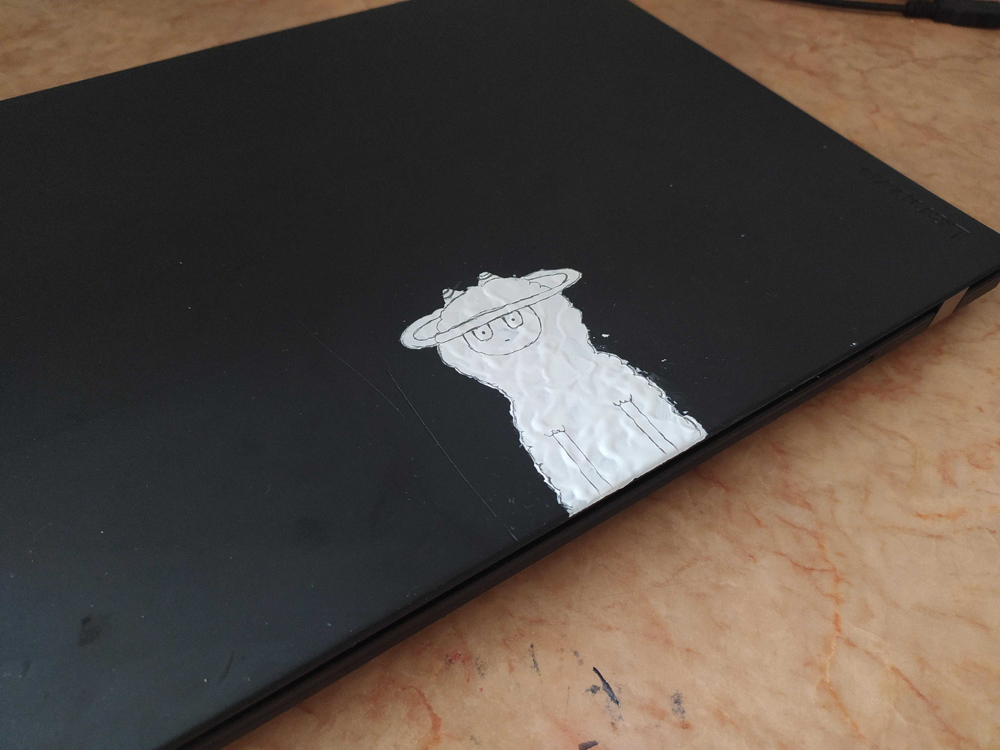

Щоб сильно не сумувати, вирішив поки зафарбувати перший варіант.

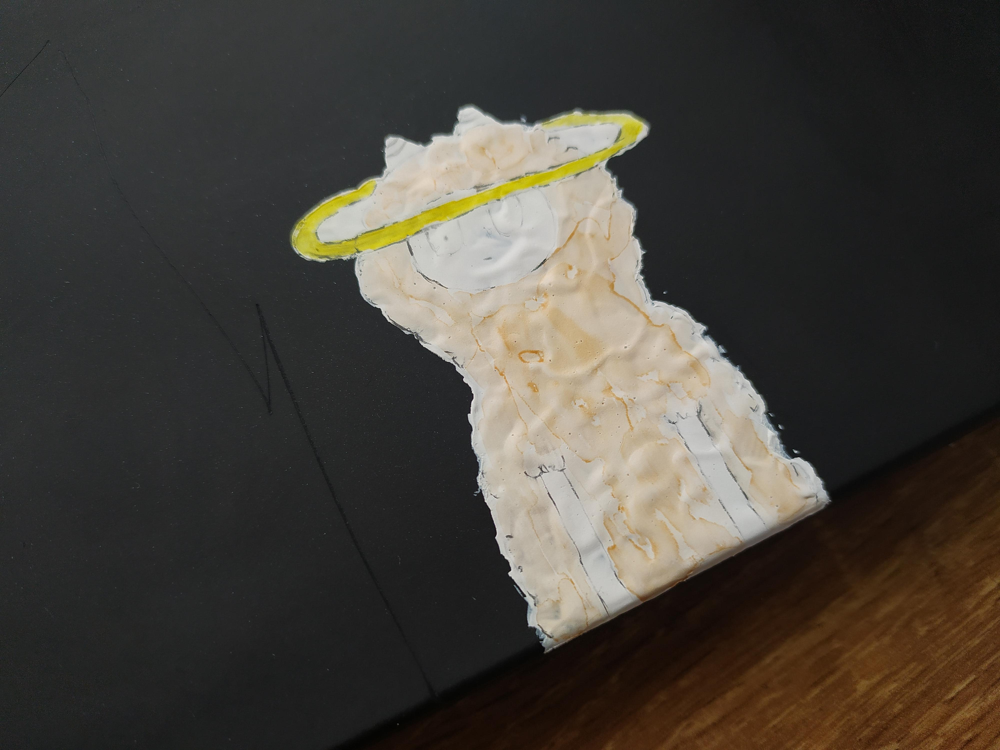

Якщо протирати серветками без вмісту спирту, то маркерна фарба тримається, а от олівець ніт.

Навів контури ручкою, ну і вона теж триматися звісно не буде, треба якийсь тонкий чорний маркер, пошукаю такий...

Власне от і все, я спробую підібрати час коли можна буде знімати трафарет, тому очікуйте третій пост)
