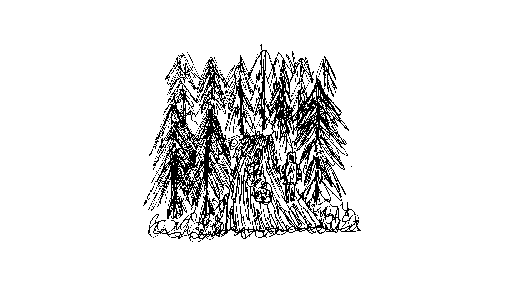

Не впевнений, що комусь буде цікаво поринути в цю атмосферу та і я не зможу її передати; якщо ти це зрозумієш, то це значить, що й сам-(а) відчуваєш таке.

Річ про відмову від обов'язків на день-два, покинення мережі та відвідування місць де ніколи не бував-(ала).

Судячи з терміну це не подорож в іншу країну, бюджет для цього теж мізерний; річ про поїздку в щось забуте, покинуте, від чого віє дискомфортом та пустотою.

В мережі можна відшукати покинуті села поряд з маленькими містами, знаходячись в них, проймаєшся якоюсь особливою локальною атмосферою.

Самі міста це лише точка на маршруті, найбільше часу потрібно провести саме в походеньках лісом, лісостепом, вздовж залізничних колій чи старих кар'єрів, в процесі розглядаючи рослини, та збираючи цікаві екземпляри.

З собою потрібно мати мінімум речей, максимально обмежитися від мережі. Звісно телефон потрібно взяти, аби хоча б слідкувати за часом.

Під час такої прогулянки можна добре та довго подумати на різні теми.

Я такого ніколи не робив та хочу спробувати. Я не знаю значення вислову "вийти із зони комфорту",  та чисто інтуїтивно мені здається що він добре характеризує мій задум.

Таке заняття сподобається не кожному, навіть мені може не сподобатися, можливо я просто сильно романтизую щось нудне.

В будь-якому випадку потрібно дочекатися наступної осені; це пора року коли зникають змії,  а в повітрі віє атмосфера від якої хочеться вкутатися в плед та пити теплий чай з малиною.

Власне через рік спробую це на собі та опишу як воно; після цього в позитивному випадку можна запросити друзів, якщо хм стане до вподоби настільки дивна ідея; вище згаданий чай стане ідеальним каталізатором цікавих розмов посеред поля.

Сказати чесно... Відчуваю певний крінж щодо цієї ідеї та його не достатньо щоб видалити мною написане.
