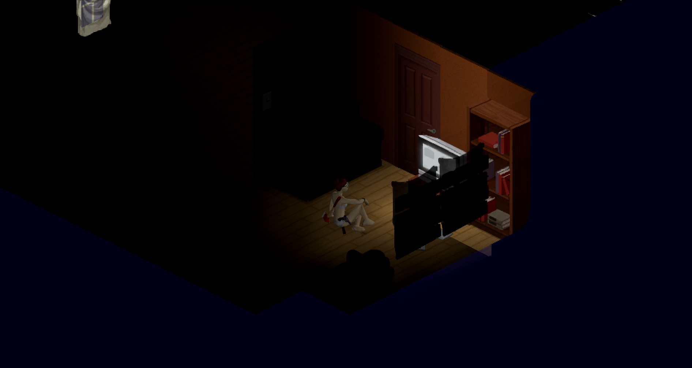

Помітив таку штуку, що мені дуже важливо підтримувати якість життя мого персонажа у PZ.

Він має набагато більше волі у своєму вигляді, постійно змінюю образ, покращую вбрання.

Я постійно годую його, хочу, щоб той мав запас їжі та ніколи не відчував голоду чи спраги. При цьому стараюся саме готувати їжу, а не їсти лише консерви, що знаходжу.

Мій персонаж розвивається всебічно, йому цікаво все, як і мені. Ніхто не обмежує мене лише одною спеціалізацією.

Жарти це важливий аспект життя, я жартую і мені стає легше, персонажу теж. "Одруження гумових каченят."

Слідкую, щоб він спав вчасно і не працював понаднормово, а також за ментальним здоров’ям, я не хочу, щоб він сумував чи впадав у депресію.

До речі про здоров’я, кожна подряпина для мене важлива, адже це питання самопочуття персонажа, постійно змінював перев’язки та дезінфікую рану. Слідкую, щоб той не був у мокрому одязі, бо може застудитися.

Оселя/база персонажа завжди захищена, з усіх сторін і виглядає затишною, адже він заслуговує на це.

Інколи я роблю значно більше ніж потрібно, продумую плани евакуації, а краще декілька планів, на випадок небезпеки.

Вибираючи характеристики персонажу я непомітно для себе створюю копію себе, інколи трішки кращу в чомусь.

Люблю прописувати його історію, таким чином я максимально асоціюю його з собою та краще відчуваю вайб гри, того світу, що я в ньому не зможу опинитися.

Може тому мені так подобається PZ? Адже вона доволі реалістична, що дає змогу асоціювати себе з персонажем, та піклуватися про нього, коли про себе піклуватися значно важче.
