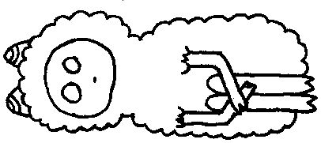

Здається я не гідний дружби та розмови, та кожна дрібна помилка може бути критичною.

---

Лише через це мені хочеться полишати всі способи зв'язку  крім єдиного найменш імовірного, а саме телефонного дзвінка.

Хоча схема виглядає небагато складніше ніж може показатися, на перший погляд.

Я не хочу докучати людям з якими хочу дружити, яких поважаю, вважаю, що мої повідомлення їх дратують, тому повинен писати лише тоді коли вони самі цього захочуть, самі напишуть першими та будуть активні в розмові, - лише тоді я можу повірити що я гідний поцікавитися дійсно важливим для мене, а допоки це станеться я маю не допустити помилки роздратувавши своїм повідомленням, згадкою про себе.

З такими думками я чекаю відповідного моменту до поки не зриваюся і не пишу набридливе "як ти?", хоча я дійсно переймаюся і не вважаю це дратівливим стосовно мене з іншої сторони.

Коли я зриваюся, мені стає соромно за себе, я можу швидко видалити  це повідомлення. Але якщо цього не стається, а повідомлення було "прямо" проігноровано, мені стає гірше. Ігнорування це якби і є роздратування мною, я картаю  себе ще більше і повертаюся до початку.

При іншому розвитку подій я блокую всі зв'язки, щоб не перевіряти кожних 5-хв чи мені хтось не написав, адже це відчуття неймовірно нестерпне і з кожним наступним разом мені стає все складніше втримуватися, щоб не написати все ще набридливе "як ти?".

Відчай бере гору і не залишається методів зв'язку крім найменш ймовірного.

Рефлекс залишається тому з рівними проміжками часу я все ще відкриваю месенджер та бачу екран входу, ось це затримка, більше я нікого не потурбую, та не буду себе картати за це в наслідку.

Ось пояснення чому я інколи втікаю з мережі, це виглядає, мабуть безглуздо, але треба було це виписати.

Адже альтернативна думка настільки ж проста як і не правильна в моєму випадку. Те що я не хочу спілкуватися абсолютно не вірно, навпаки я цього хочу та повинен дотримуватися обмежень, щоб не зіпсувати випадково нічого, е допустити тієї болючої помилки,  яку я довго ще не зможу пробачити собі.

Тому виходить так щоб спілкуватися я повинен обмежити себе в цьому спілкуванні.

Мабуть, єдиним вирішенням цієї постійної головної болі буде гарна довіра і розуміння свого положення, це треба проговорити відкрито, я хочу довіряти, але для цього мені потрібна згода на довіру.

Виходить доволі заплутано, що дещо зводить з розуму.

Я не хочу докучати поважним людям.

---

Тому єдине, що я зроблю це порину у світ без зв'язку та доступу до мережі, єдине чим мені слід зайнятися це знайти роботу та невпинно працювати з надією на те, що  колись настане час, щоб я був гідний отримати чи написати повідомлення.

### Гідність згадки, - те, що мене дійсно турбує.
